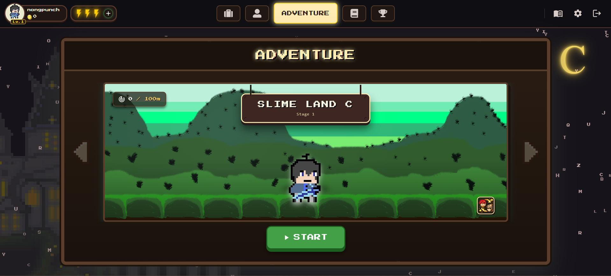
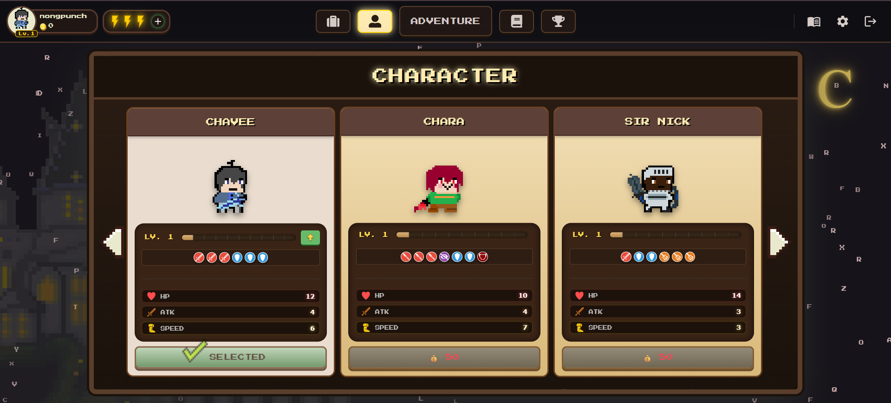
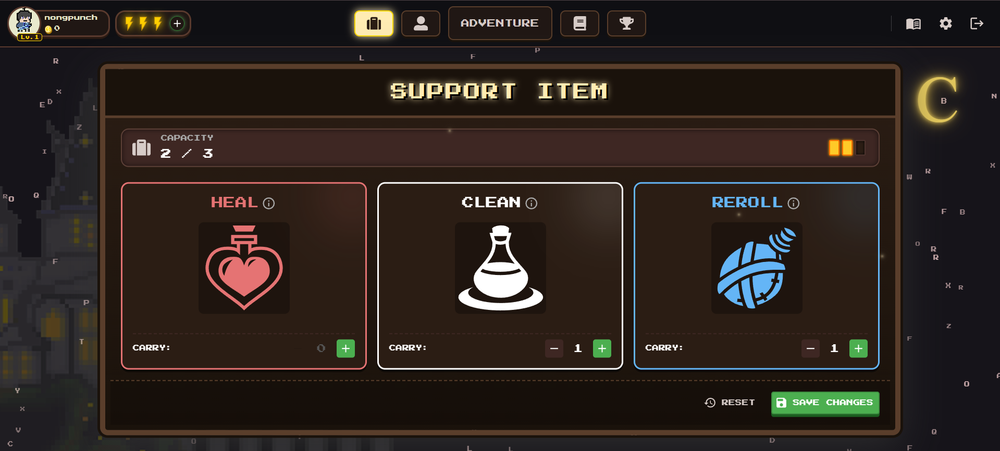
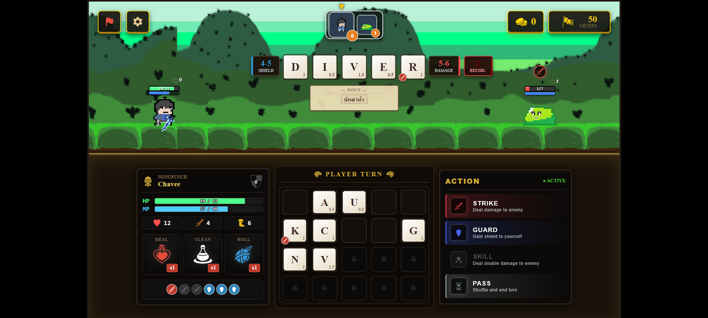

# Word Game
- web game on website (deployed by vercel ): https://spellxspell.vercel.app

---
#### Preview UI Word Game 
- HomePage (Adventure Feature)

  
  
แสดงด่านปัจจุบันของผู้เล่น (เป็นฟีเจอร์แรกที่จะแสดงขึ้นมาใน HomePage)

-----

- Character Feature (Selected from Appbar/Navbar)

  
    
แสดงตัวละครทั้งหมด โดยสามารถซื้อ,อัปเกรด,เลือกตัวละเพื่อเล่น

-----

- Item Feature (Selected from Appbar/Navbar)

  
   
จัดการ potion สำหรับนำไปเล่นเกม โดยมีlimit ในการบรรจุ

-----

- GamePage (After Player Click Button "Start Game")

  
   
ประกอบตัวอักษรภาษาอังกฤษที่มีความหมาย โจมตีศัตรู

